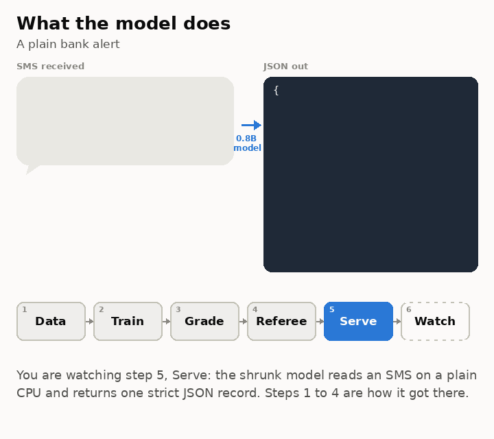
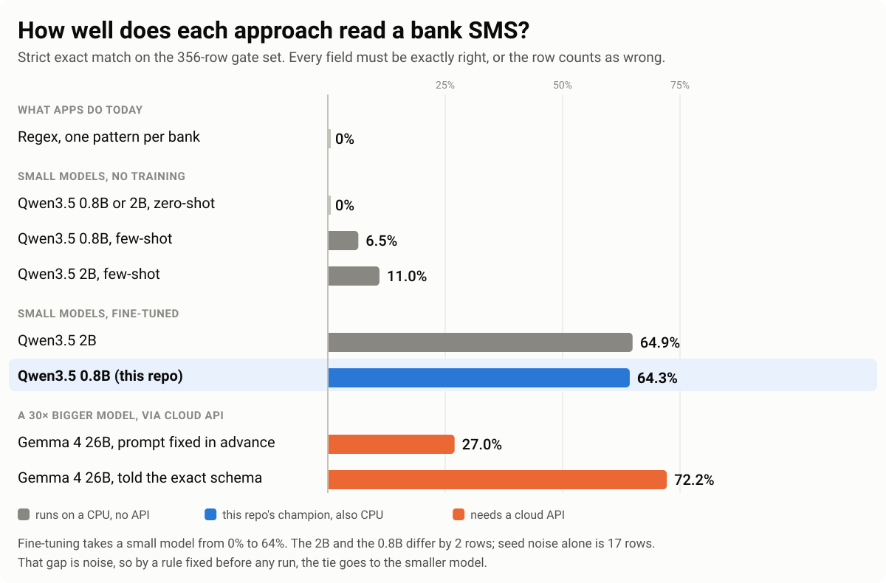
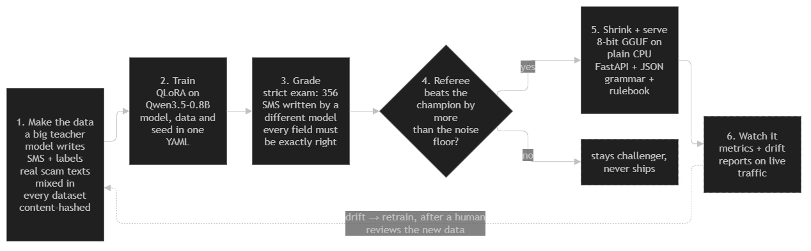

# TinyLLM Ops 

**A 0.8B language model fine-tuned to read Indian bank SMS and flag scams, small enough to
run offline on a CPU or a phone, wrapped in the MLOps machinery that grades it honestly,
promotes a new model only when it is genuinely better, and will retrain it when the world
drifts. Built for about $40.**

| Headline | Number |
|---|---|
| Strict exact match on the 356-row gate set (every field right, or the row is wrong) | **64.3%** (229/356) |
| Frozen final set, opened exactly once | **59.9%** (106/177) |
| Real scam texts flagged, none mistaken for a transaction | **55 of 60** (91.7%) |
| Served model size and speed on a laptop CPU | **0.81 GB · ~5 s per SMS on 2 threads** |

<p align="center">
  
</p>

<p align="center">
  <picture>
    <source media="(prefers-color-scheme: dark)" srcset="docs/img/results_ladder_dark.svg">
    
  </picture>
</p>

**Status:** data, training, evaluation, pipeline + registry + referee, and
quantize + serve are built. CI/CD and monitoring with automated retraining are designed and
are the next two stages. The table under "Why the engineering is the point" marks each.

---

## The problem

Every payment in India generates a text: "Rs.450 debited from a/c **1234 to SWIGGY via UPI".
An expense app has to turn that into structured data (how much, in or out, to whom, which
channel, what category), and it also has to spot the scam texts that imitate those same bank
alerts. Many of these messages are in Hinglish (Hindi words in Roman script mixed with
English), so the training and test data include Hinglish messages too.

Today apps do this with hand-written regex, one pattern per bank template, which silently
breaks every time a bank reformats its alerts. And financial SMS is exactly the data you
*shouldn't* ship to a cloud API, so the right answer has to be small enough to run on-device.

This repo takes a small language model, teaches it that one job, shrinks it until it runs on
a plain CPU, and then builds the machinery around it: how the data is made and versioned, how
the model is graded without fooling yourself, how a new model gets promoted only when it beats
the old one by more than noise, and how it gets shrunk and served. The model is about a third
of the work. The rest is the platform.

<!-- image slot (optional): annotated phone mockup of a real-looking SMS with arrows to the JSON fields. -->

## The solution

Take the **Qwen3.5 0.8B** model (0.8 billion parameters) and fine-tune it with **QLoRA**
until it turns any transaction SMS into a strict, schema-valid record:

```json
{
  "is_transaction": true,
  "txn_type": "debit",
  "amount": "450.00",
  "currency": "INR",
  "counterparty": "Swiggy",
  "account_tail": "1234",
  "channel": "UPI",
  "category": "food",
  "is_suspected_scam": false
}
```

**Training facts.** 11,120 synthetic + curated training rows · LoRA rank 16, learning rate
1e-4, 2 epochs, seed 42 · one Colab L4 GPU, about 2.5 hours per run · training teacher
Gemini 3.5 Flash Lite, test-set teacher Gemini 3.5 Flash (a different model, on purpose).

### How it scores

Every model below is graded on the same hand-reviewed 356-row gate set, written by a
different model than the training teacher. "Exact match" is strict: the output must be valid
JSON, pass the schema, and have *every* field right.

| Model | Exact match (356 rows) | Serving cost |
|---|---|---|
| Per-template regex (what apps use today) | 0% | ~free |
| Qwen3.5 0.8B or 2B, zero-shot | 0% | CPU |
| Qwen3.5 0.8B, few-shot | 6.5% | CPU |
| Qwen3.5 2B, few-shot | 11.0% | CPU |
| Qwen3.5 2B, fine-tuned (best of 5 runs: 63.5–69.9%) | 64.9% | CPU |
| **Qwen3.5 0.8B, fine-tuned: the champion** | **64.3%** | **CPU / on-device, ~$0/mo** |
| ↳ the same model as served, 8-bit GGUF on CPU | 63.8% (227/356) | 0.81 GB, 23 tok/s laptop CPU |
| ↳ the served *system*: 8-bit + JSON grammar + merchant rulebook | 68.0% (242/356) | same |
| Gemma 4 26B, few-shot, pre-registered prompt (~30× bigger) | 27.0% | API $$ |
| Gemma 4 26B, few-shot, told the exact output schema | 72.2% | API $$ |

**What the table says, in plain words.** Regex scores zero and the small models score zero
out of the box. Fine-tuning is the big change: it takes the 0.8B from 0% to 64% in one
afternoon on one GPU.

**The other big decision was picking the smaller model on purpose.** The 2B and the 0.8B
landed within a few rows of each other, and two runs of the *same* recipe differ by 17 rows
just from the random seed, so that gap is noise. A rule written down before any run said ties
go to the smaller model, so the 0.8B is the champion: half the size, same score.

**The 26B only wins once it is told the exact schema.** With the prompt fixed in advance it
scores 27%; told the field values, 72%. The 0.8B reaches 89% of that schema-informed score,
offline, at about 1/30th the parameters. It is a few-shot baseline, not a fine-tuned one, so
the fairer comparison is the fine-tuned 2B above, which it ties.

**Two columns, always.** The model's own number (227/356) and the served system's number
(242/356) are reported separately. The grammar changes no verdicts, it only guarantees the
output parses. The rulebook fixes 15 gate rows and breaks none.

### Once-only sets, spent exactly once on the champion

| Set | What it tests | Rows | Score |
|---|---|---|---|
| Frozen final | Same style as the gate, never looked at during the sweep | 177 | **59.9%** (±7 pt) |
| Out-of-distribution | 25 *real* bank SMS in real formatting, never trained on | 25 | **44%** (11/25; tiny set, wide error bar) |
| Real scam holdout | 60 real smishing texts, model trained only on synthetic Indian scams | 60 | **91.7%** flagged (55/60), zero mistaken for a transaction |

The final set lands 4 points under the gate, inside the gate's own error bar, so there is no
sign that the sweep over-fitted the exam.

## How it all fits together

Every box is one stage. The dashed box is not built yet.



1. **Make the data.** A large model writes thousands of realistic bank SMS with labels. Real
   scam texts are mixed in. Every row is checked against the schema and every dataset gets a
   content hash, so a training run can always say exactly which bytes it saw.
2. **Train.** QLoRA fine-tuning: the base model stays frozen in 4-bit and a small adapter
   learns the task. Which model, which data, which seed: all in one config file.
3. **Grade.** The new model sits a strict exam written by a different model than its teacher,
   so it cannot have memorised the questions. A frozen final set is opened once.
4. **Referee.** A separate script compares the new model to the current champion on the same
   exam and promotes it only if the gap is bigger than the measured noise. The training
   pipeline cannot promote its own model.
5. **Shrink and serve.** The champion becomes an 8-bit GGUF file running on plain CPU behind
   a small API. A grammar forces the output to be valid JSON every time.
6. **Watch it.** Live traffic is logged and checked for drift. When the world changes, that
   triggers a retrain, and the loop starts again from step 1, with a human reviewing any
   production data before it becomes training data.

## Why the engineering is the point

Training the model takes an afternoon. The project is the **platform around it**, a closed
loop that most fine-tuning demos never build.

| Piece | Why this problem needs it, and what it gives us | Status |
|---|---|---|
| **Reproducibility.** Every run tied to a git commit, a config YAML, a seed and a content-hashed dataset manifest; tracked in MLflow on Azure ML | Two runs of the same recipe already differ by 17 rows from the seed alone. Without exact records you cannot tell a real gain from luck. Every number in this README traces back to the code, data and settings that produced it. | Built |
| **Orchestration.** One ZenML pipeline: load → validate → train → gate → quantize → register, in small typed steps, each unit-tested, with caching | The same steps run the 0.8B and the 2B one YAML line apart, and a retrain later is one command, not a notebook. A model that fails the gate step never reaches the registry. | Built |
| **Registry + referee.** MLflow registry with two labels, `champion` and `challenger`. The pipeline may only set challenger. A separate referee script moves champion | Most fine-tuning projects ship whatever scored best today. Here the bar is "beats the incumbent by more than noise, on the same exam", written down before the run. The model that ships was chosen by a rule, not by the person who trained it. | Built |
| **Serving.** 8-bit GGUF on `llama-server` behind a FastAPI gateway: grammar-constrained decoding, API keys, rate limits, Docker. The container downloads the model at boot and never talks to MLflow | Financial SMS should not go to a cloud API, and the users are phones and cheap servers. CPU-only serving keeps it near-free and on-device-ready. Valid JSON on 100% of requests, 0.81 GB, about 5 s per full transaction on 2 CPU threads. | Built |
| **Testing.** The code that *judges* the model is tested like the model: hand-computed fixtures for the eval harness, a behavioural suite that perturbs amounts and merchants, gateway auth edge cases against a mock backend, a container integration test | The whole project rests on the exam being graded right. A bug in the grader is worse than a bug in the model, because it hides. | Built |
| **CI/CD.** GitHub Actions with keyless OIDC auth to Azure: tests on every PR; on merge, launch the pipeline on a GPU box, run the referee, deploy blue-green to Azure Container Apps with a one-line rollback | Retraining is only useful if a better model reaches users without ten manual steps. Merge → train → grade → promote → deploy, with smoke tests after and a rollback if they fail. | Planned |
| **Monitoring + closed loop.** Metrics pushed to Grafana (push, because scale-to-zero leaves nothing to scrape), per-request traces with a schema-validity flag, nightly Evidently drift reports, a drift alert that triggers retraining | Banks change their SMS wording and scammers change theirs faster. A model that is never re-checked quietly gets worse. Production rows enter training only after validation **and** a human look, because data poisoning is a real threat here. | Planned |
| **Optimization study.** Accuracy, latency and size across {0.8B, 2B} × {fp16, Q8, Q4}; load tests; $/1M tokens on CPU vs GPU | "How much model does this task need?" is the question most fine-tuning projects skip. Answer so far: 0.8B at 8-bit on CPU (4-bit lost 20 rows, 8-bit lost 2). | Quant study built; cost study planned |

<!-- image slots: MLflow registry screenshot showing the champion/challenger aliases (under Registry + referee); f16 / Q8 / Q4 accuracy-vs-size chart (under Optimization study); Grafana dashboard once Monitoring is built. -->

## Try it, and reproduce the numbers

Run the served system locally (needs Docker and the champion GGUF, published to Blob on
promotion):

```bash
docker run -d -p 8080:8080 -e API_KEYS=dev -e RULEBOOK=1 \
  -v $PWD/outputs/exp_111/gguf/Q8_0.gguf:/models/model.gguf tinyllm-ops

curl -s -X POST localhost:8080/parse \
  -H 'x-api-key: dev' -H 'content-type: application/json' \
  -d '{"sms": "Rs.450 debited from a/c **1234 to SWIGGY via UPI on 05-10-26. Ref 1234567890"}'
```

```json
{"is_transaction": true, "txn_type": "debit", "amount": "450.00", "currency": "INR",
 "counterparty": "Swiggy", "account_tail": "1234", "channel": "UPI", "category": "food",
 "is_suspected_scam": false}
```

Reproduce the headline number (the gate set is fetched from Blob and hash-verified via its
manifest):

```bash
uv sync
uv run python -m tinyllm.manifest fetch --manifest manifests/test_gate_v2.json --out data/generated/test_gate_v2.jsonl
uv run python -m tinyllm.model_eval --model outputs/exp_111/merged --chat --data data/generated/test_gate_v2.jsonl
#   → exact match 229/356 = 64.3%
uv run python -m tinyllm.model_eval --backend llama --url http://127.0.0.1:8081 --constrained \
  --model outputs/exp_111/gguf/Q8_0.gguf --tokenizer outputs/exp_111/merged --chat \
  --data data/generated/test_gate_v2.jsonl
#   → the served Q8_0 under the JSON grammar, 227/356 (needs llama-server running on :8081)
uv run python run_pipeline.py --config configs/exp_100_smoke.yaml   # 50-example CPU smoke run of the whole DAG
uv run pytest                                                       # unit tests; -m integration hits a running container
```

## Where things live

| Path | What it is |
|---|---|
| [src/tinyllm/train.py](src/tinyllm/train.py) | QLoRA fine-tuning, config-driven |
| [src/tinyllm/eval.py](src/tinyllm/eval.py) · [model_eval.py](src/tinyllm/model_eval.py) · [behaviors.py](src/tinyllm/behaviors.py) | Strict exact-match grading, the model-eval CLI, the behavioural checks |
| [src/tinyllm/promote.py](src/tinyllm/promote.py) | The referee |
| [src/tinyllm/quantize.py](src/tinyllm/quantize.py) | GGUF export and quant selection |
| [src/tinyllm/schema.py](src/tinyllm/schema.py) · [validate.py](src/tinyllm/validate.py) · [manifest.py](src/tinyllm/manifest.py) | The one schema, the data validation gate, hash manifests |
| [src/tinyllm/data_gen.py](src/tinyllm/data_gen.py) · [test_gen.py](src/tinyllm/test_gen.py) · [templates.py](src/tinyllm/templates.py) | Training-data and test-set generation |
| [pipelines/training_pipeline.py](pipelines/training_pipeline.py) · [run_pipeline.py](run_pipeline.py) | The ZenML DAG and its one entry point |
| [serving/](serving/) | FastAPI gateway, prompt, Dockerfile, start script |
| [configs/](configs/) · [manifests/](manifests/) | Experiment YAMLs and dataset manifests (data itself never enters git) |
| [tests/](tests/) | Unit, gate, gateway and container integration tests |

## Cost

Runs on an Azure for Students subscription: Container Apps free grant + scale-to-zero,
hosted MLflow via Azure ML, ghcr.io images, Blob storage, Grafana Cloud free tier. Two paid
pieces: Colab Pro for training (L4 GPU; a run is ~2.5 h for either model size, because the
linear-attention layers fall back to pure PyTorch) and a billing-enabled Gemini key for
test-set generation and the 26B baseline (the free tier's 20 requests/day was not enough).
Total: **$25–40**.

## License

Code: MIT. Fine-tuned weights derive from Qwen3.5 (Apache-2.0).
